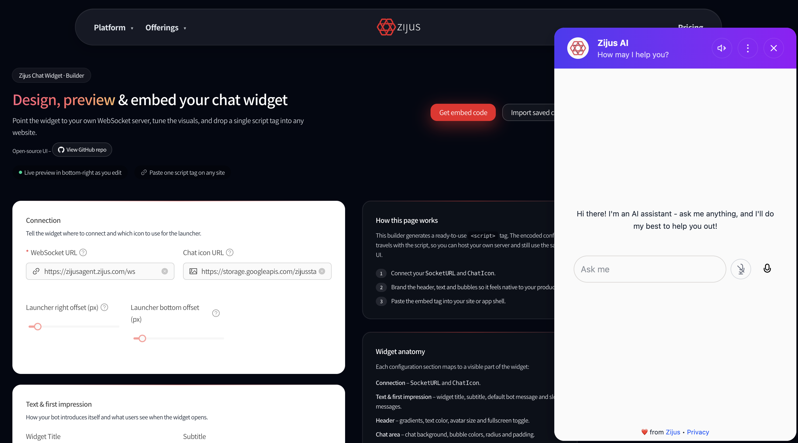

# 🚀 Zijus Chat UI — Free, Enterprise-Grade Chat Client for Agentic Frameworks

### **A framework-agnostic, production-ready chat interface for LLM agents**

**Zijus Chat UI** is a free, customizable, enterprise-grade chat client created for the **Zijus Agentic SaaS Platform** and now released for developers building AI agents across any framework.
Instead of building chat UIs from scratch, you can plug in our WebSocket-based client and focus entirely on your agent logic.


Works seamlessly with:

* **LangChain**
* **Agno**
* **Microsoft Agent Framework**
* **Google ADK**
* **Autogen**
* **AWS Strands**
* **Custom agent stacks**

…and any other agentic framework.

👉 Watch the Full Tutorial on **YouTube**
[](https://youtu.be/DvL6vTIra_I)


---

# 🌟 Why We Built This

Modern LLM frameworks are powerful, but developers still struggle with one missing piece:

> ❗ *A long-term-supported, enterprise-quality chat UI that works with every agentic backend.*

Zijus Chat UI solves that.

You get:

* A **free embeddable JS client**
* A **UI config generator** (no coding required)
* **Open-source backend examples**
* WebSocket support
* A **unified message schema**

This is the same client powering production workloads on the **Zijus platform**, ensuring long-term updates and reliability.

---

# 🧩 Features

### ✔️ **Free embeddable chat client**

Available in the `dist/` folder and via CDN.

### ✔️ **Highly customizable UI**

Use our hosted generator:

👉 **[https://www.zijus.com/zijus-chat-ui](https://www.zijus.com/zijus-chat-ui)**

Customize the full look & feel and export a single JS snippet.

### ✔️ **Framework-agnostic**

Example integrations for multiple agent frameworks included.

### ✔️ **Unified message format**

Each framework outputs different message shapes — our examples show how to convert them into the UI’s standard format.

### ✔️ **WebSocket-based backend**

All examples are powered by FastAPI WebSockets.

### ✔️ **Actively maintained**

Because we use this UI internally, it will continuously evolve.

---

# 📦 Repository Structure

Here is the **accurate and updated** structure:

```
dist/
    zijus-webclient-v0.1.0.js    # Embeddable chat UI client

examples/
    agents/
        python/
            langchain/
                my_agent/
                    agent.py
                utils.py
                main.py
                requirements.txt
                env-sample
                README.md
                templates/
                    index.html     # Demo page showing UI usage

            agno/
                my_agent/
                    agent.py
                utils.py
                main.py
                requirements.txt
                env-sample
                README.md
                templates/
                    index.html

            autogen/
                ...
```

### Notes

* **`dist/zijus-webclient-v0.1.0.js`** is the compiled chat client developers embed in their application.
* **`templates/index.html`** inside each framework folder demonstrates how to embed and configure the UI for local testing.
* The backend logic is fully open-source — the UI JavaScript bundle is free and publicly available.

---

# 🧪 Running an Example

For Python frameworks:

```bash
cd examples/agents/python/<framework>

python3 -m venv venv
source venv/bin/activate     # or venv\Scripts\activate on Windows
pip install -r requirements.txt
cp env-sample .env
uvicorn main:app --reload
```

Then open:

```
http://localhost:8000
```

You’ll see the Zijus Chat UI loaded via `templates/index.html`.

---

# 🧰 Backend Integration

Each framework folder includes:

* **my_agent/agent.py** – your agent definition
* **utils.py** – translation + helper layer
* **main.py** – FastAPI WebSocket backend
* **templates/index.html** – demo UI embedding page

### About `utils.py`

This contains example or placeholder logic for:

* converting framework outputs → UI schema
* handling streaming tokens
* preparing message metadata
* managing avatars, roles, tool responses

Developers can customize this freely.

---

# 🎨 Customizing the UI (No Code)

Use our UI builder:

👉 **[https://www.zijus.com/zijus-chat-ui](https://www.zijus.com/zijus-chat-ui?utm_source=github)**

This tool lets you configure:

* Theme / colors
* Avatars & branding
* Layout & behavior
* Animation options

Note: For the WebSocket URL, use `http://localhost:8000/ws` if you are running the agent locally



Then it gives you a snippet such as:

```html
<script async src="https://cdn.jsdelivr.net/gh/zijus/zijus-chat-ui@main/dist/zijus-webclient-v0.1.0.js" zijus-config='...'>

</script>
```

Drop this into any HTML page — instant chat UI.

---

# 🔮 Roadmap

We’re working on:

* Dynamic client-side HTML/DOM rendering

Continuous updates are guaranteed because the UI powers the **Zijus platform**.

---

# 🤝 Contributing

We welcome contributions!

* ⭐ Star the repo if it helps you
* 🐛 Open issues for bugs or questions
* 🔧 Submit PRs for new examples, bug fixes, or enhancements

---

# 📬 Contact

* Website: [https://www.zijus.com](https://www.zijus.com)
* Config Generator: [https://www.zijus.com/zijus-chat-ui](https://www.zijus.com/zijus-chat-ui)
* Email: [hello@zijus.com](mailto:hello@zijus.com)

---

# ❤️ Thank You

Zijus Chat UI is built to eliminate the repetitive work of UI development in agentic projects.
Enjoy frictionless building — and let us know what you create!

